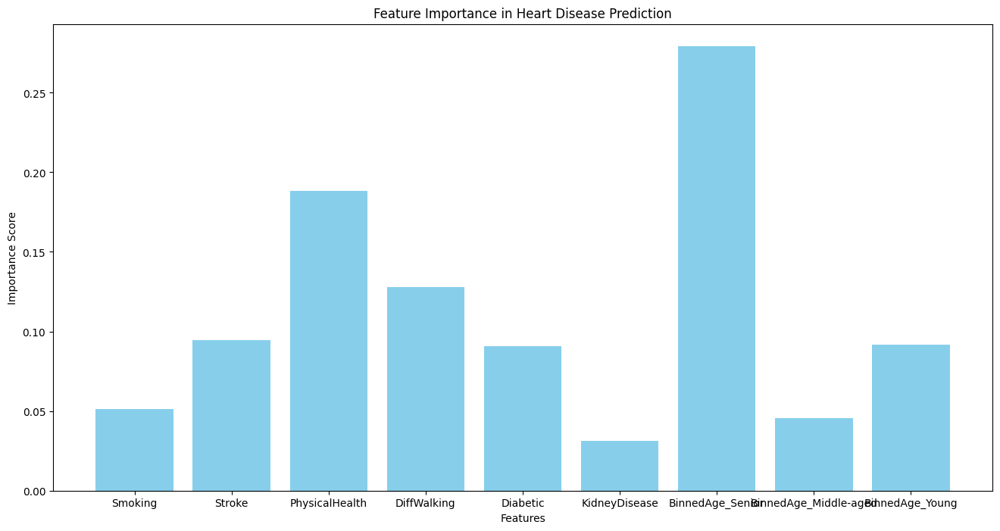

---

# Heart Disease Prediction with Random Forest Classifier  

This project focuses on predicting heart disease using a **Random Forest Classifier**. The dataset consists of various health indicators, and the goal is to preprocess the data, handle class imbalance, and build a model for accurate heart disease prediction.  

---

## 🚀 Project Overview  

- **Dataset**: `heart_2020_cleaned.csv`  
- **Model**: Random Forest Classifier  
- **Tech Stack**: Python, NumPy, Pandas, Scikit-learn, Matplotlib, Seaborn  
- **Evaluation Metrics**: Accuracy, Precision, Recall, F1 Score  

---

## 📊 Dataset Description  

The dataset contains **319,795 entries** and **18 features**, representing various health indicators:  

| Feature           | Description                      |
|-------------------|----------------------------------|
| **HeartDisease**  | Target variable (Yes/No)         |
| **BMI**           | Body Mass Index                  |
| **Smoking**       | Smoking status (Yes/No)          |
| **AlcoholDrinking** | Alcohol consumption (Yes/No)   |
| **Stroke**        | History of stroke (Yes/No)       |
| **PhysicalHealth** | Days of poor physical health    |
| **MentalHealth**  | Days of poor mental health       |
| **DiffWalking**   | Difficulty walking (Yes/No)      |
| **Sex**           | Male/Female                      |
| **AgeCategory**   | 13 age groups (18–24 to 80+)     |
| **Race**          | Ethnicity                        |
| **Diabetic**      | Diabetes diagnosis status        |
| **PhysicalActivity** | Physical activity in last 30 days |
| **GenHealth**     | Self-rated health (Excellent–Poor) |
| **SleepTime**     | Average hours of sleep per day   |
| **Asthma**        | Asthma diagnosis (Yes/No)        |
| **KidneyDisease** | Kidney disease diagnosis (Yes/No)|
| **SkinCancer**    | Skin cancer diagnosis (Yes/No)   |

---

## ⚙️ Project Workflow  

### 1. Data Preprocessing  

- **Label Encoding** for categorical features (`GenHealth`, `Race`, etc.).  
- **Binary Conversion**: Converted `Yes/No` to `1/0`.  
- **Age Binning**: Grouped `AgeCategory` into broader groups (Young, Middle-aged, Senior).  
- **Feature Selection**: Retained highly correlated features using correlation heatmaps.  

### 2. Handling Class Imbalance  

- Used **RandomUnderSampler** from `imblearn` to balance the dataset, ensuring the model does not favor the majority class (No Heart Disease).  

### 3. Model Development  

- **Train-Test Split**: 80% training, 20% testing.  
- **Pipeline**: Included `MinMaxScaler` and `RandomForestClassifier`.  

---

## 📈 Model Performance  

| Metric         | Score  |
|----------------|--------|
| **Accuracy**   | 72.38% |
| **Precision**  | 20%    |
| **Recall**     | 73%    |
| **F1 Score**   | 31%    |

### Classification Report  

| Class | Precision | Recall | F1 Score | Support  |
|-------|-----------|--------|----------|----------|
| **0 (No Heart Disease)** | 0.97 | 0.72 | 0.83 | 204,773 |
| **1 (Heart Disease)**    | 0.20 | 0.73 | 0.31 | 19,083  |

### 🔍 Interpretation of Metrics  

- **Precision**: Of all predicted heart disease cases, only 20% were correct.  
- **Recall**: The model correctly identified 73% of actual heart disease cases.  
- **F1 Score**: A balance between precision and recall, reflecting the trade-off between false positives and false negatives.  
- **Accuracy**: The model correctly predicted the outcome 72.38% of the time.  

---

## 📊 Visualizations  


### Feature Importance  
  


---

## 🛠️ Installation & Usage  

1. **Clone the Repository**  
   ```bash
   git clone https://github.com/username/heart-disease-prediction.git
   cd heart-disease-prediction
   ```  

2. **Install Dependencies**  
   ```bash
   pip install -r requirements.txt
   ```  

3. **Run the Preprocessing and Training Script**  
   ```bash
   python train_model.py
   ```  

4. **Evaluate the Model**  
   - The trained model is saved using `joblib` for future use.  

---

## 🔍 Understanding Random Forest Classifier  

### What is Random Forest?  

Random Forest is an **ensemble learning method** that builds multiple decision trees and combines their results to improve accuracy and reduce overfitting.  

- **Bagging (Bootstrap Aggregating)**: Each tree is built using a random subset of the training data.  
- **Feature Randomness**: At each split, a random subset of features is considered to reduce correlation between trees.  
- **Majority Voting**: For classification, the final prediction is based on the majority vote across all trees.  


---

### 📊 **Mathematical Concepts**  


#### 🔹 **Gini Impurity**  
Used to measure the quality of splits in decision trees. Lower Gini values indicate purer splits.  
Formula:  
\[ G = 1 - \sum p_i^2 \]  
Where \( p_i \) is the probability of class \( i \).  

**Example:**  
- If data is perfectly split into one class, \( G = 0 \).  
- If the data is evenly split between two classes, \( G = 0.5 \).  

#### 🔹 **Entropy**  
Entropy measures the randomness or disorder in the data. It’s used for information gain in decision trees.  
Formula:  
\[ H = -\sum p_i \log_2(p_i) \]  

**Example:**  
- When all samples belong to a single class, \( H = 0 \).  
- When samples are evenly split between classes, \( H = 1 \).  


## 📂 Repository Structure  

```
|-- data/                    # Dataset folder  
|   |-- heart_2020_cleaned.csv  
|  
|-- src/                     # Source code folder  
|   |-- requirements.txt     #contain required libraries for streamlit deployment        
|   |-- index.ipynb          # Training and evaluation script
|   |-- app.py               # streamlit application        
|  
|   | model/                   # Trained model folder  
|     |-- saved_model.pkl       # Saved model file  
|  
|-- README.md                # Project documentation  
```  

---

## 🌟 Future Work  

- **Hyperparameter Tuning**: Improve the model with advanced optimization techniques.  
- **Explore Other Classifiers**: Compare Random Forest with XGBoost and Neural Networks.  

---

## ✍️ Author  

**Safwan Ali** – Data Science Enthusiast & Developer  

### Connect with Me  

- **GitHub**: [Safwan2003](https://github.com/Safwan2003)  
- **LinkedIn**: [Safwan Ali](https://www.linkedin.com/in/safwan-ali-281aa1275/)  

---
